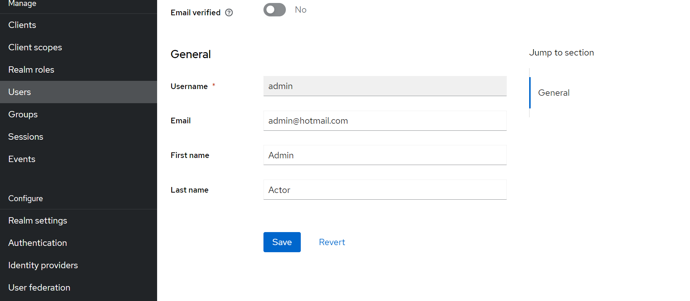
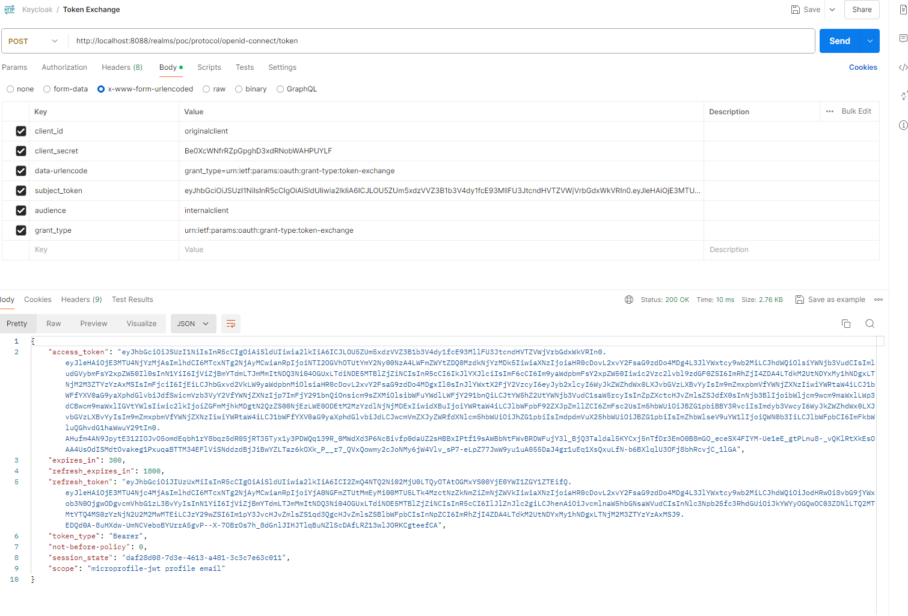
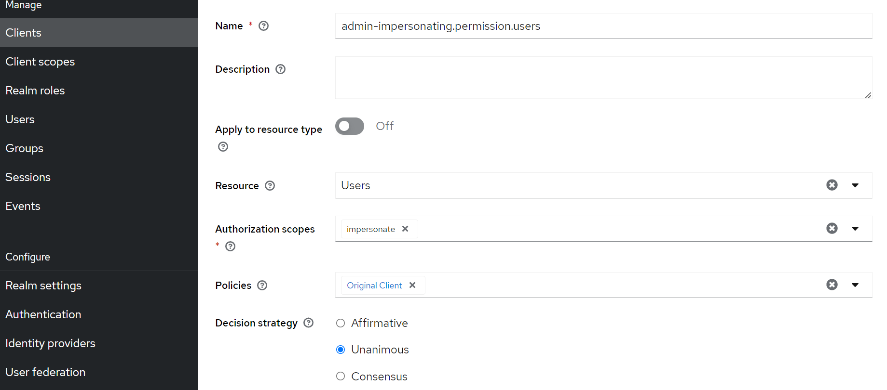
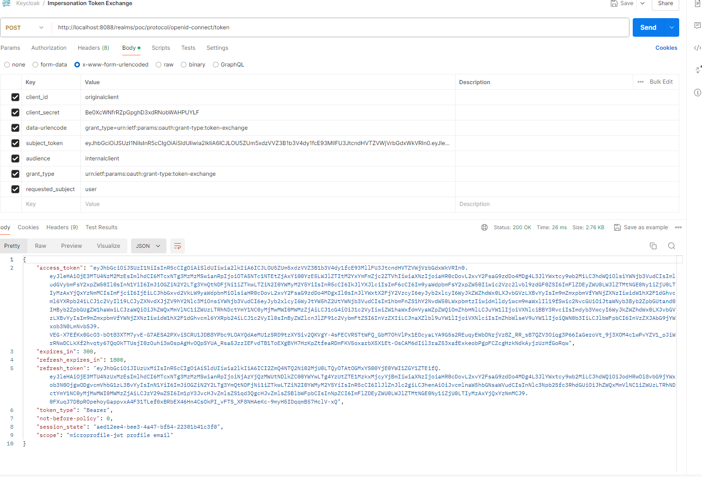

# Description
PoC Keycloak Token Exchange.

## Introduccion

In Keycloak, token exchange is the process of using a set of credentials or token to obtain an entirely different token. Exist 4 token exchange implementations:

1. A client may want to invoke on a less trusted application so it may want to downgrade the current token it has.
2. A client may want to exchange a Keycloak token for a token stored for a linked social provider account. 
3. You may want to trust external tokens minted by other Keycloak realms or foreign IDPs.
4. A client may have a need to impersonate a user

Here’s a short summary of the current capabilities of Keycloak around token exchange:

1. Internal token to internal token exchange: A client can exchange an existing Keycloak token created for a specific client for a new token targeted to a different client
2. Internal token to external token exchange: A client can exchange an existing Keycloak token for an external token, i.e. a linked Facebook account
3. External token to internal token exchange: A client can exchange an external token for a Keycloak token
4. Impersonation: A client can impersonate a user

In all of them the uri to request this exchange is always de same:

```shell
/realms/{realm}/protocol/openid-connect/token
```

## Install infrastructure:

Before start we need a Keycloak instance correctly configured. By default the Token Exchange specification is not actived in Keycloak so we must to deploy Keycloak with these this properties included. We will used these parameters:

- **Port**: 8080
- **Keycload admin credentials**: admin/password
- **Properties to be activated**: token-exchange, admin-fine-grained-authz. Note: **impersonation is activated by default.**
- **Image Tag**: quay.io/keycloak/keycloak:24.0.4

Execute this docker command:

```shell
docker run -d --name keycloak -p 8088:8080 -e KEYCLOAK_ADMIN=admin -e KEYCLOAK_ADMIN_PASSWORD=password -e KC_FEATURES=token-exchange,admin-fine-grained-authz quay.io/keycloak/keycloak:24.0.4 start-dev
```

## Exchange Token Steps

**STEP01**: Create a new realm where configure the keycloak resources like: clients, users, groups, permissions and policies.


**STEP01**: Create two clients to configure the token-exchange between them:

First create the **Original Client** to exchange a token with other one from **Internal Client** with this data:

- **Client ID**: originalclient
- **Name**: Original Client
- **Client authentication**: true

Original Client Name Step:


Original Client Authentication Flag Step:


Later we can get the client secret from the Credentials Tan inside the client just created:


Second create the **Internal Client** where we defined a permission to permit exchange tokens with this data:

- **Client ID**: internalclient
- **Name**: Internal Client
- **Client authentication**: true

Internal Client Name Step:


Internal Client Authentication Flag Step:


Also we can recover the client secret used in the next requests.

**STEP02**: Create a admin user with a admin role to be tested

Create the **Admin Role** from Realm roles option menu like this:


Create the **Admin User** with credentials from Users option menu like this:



Set credentiasl password from credentials. Set not validate the credentials, like this:


**STEP03**: Create a permission called **token-exchange** from client **Internal Client** in **Permissions** Tab like this:

We must activate permissions enabled (this tab exist because we start Keycloak with the token-exchange option):


**STEP04**: Create a client policy attached to the **Original Client**


**STEP05**: Bind the Client Policyt to the **Internal Client**

## Make a test for exchange token

**STEP01**: Issue a token from **Original Client** using the admin credentials:


**STEP02**: Exchange the token obtained before with a new one from **Internal Client**



**STEP03**: We can check the session impersonate


## Impersonation Steps

Now we have the resources already created: users, groups and clients. We only must create a new client permissions for impersonate users.

Go to Users, permission tabs and create a new **impersonate permission** and bind to the previous client policy created for the Original Client like this:



## Make a test for Impersonation

**STEP01**: Issue a token from **Original Client** using the admin credentials as previous


**STEP02**: impersonate our token for a new user



**STEP03**: We can check the session impersonate


## Some Links

- [Keycloak Getting Started](https://www.keycloak.org/getting-started/getting-started-docker)
- [Keycloak Exchange Token Documentation](https://www.keycloak.org/docs/latest/securing_apps/#_token-exchange)

